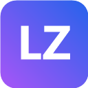

# BeePlus for Beekeeper

<p align="center">
  
</p>

<p align="center">
  <b>Productivity add-ons for Beekeeper.</b><br>
  Profile hover, pinned chats, polls, reminders, stats, export — all toggleable.
</p>

<p align="center">
  <a href="https://github.com/lupzn/beeplus-for-beekeeper/releases/latest"></a>
  <a href="LICENSE"></a>
  <a href="https://www.paypal.com/donate/?hosted_button_id=X8MG6CZK2PETS"></a>
</p>

> **Unofficial** — not affiliated with or endorsed by Beekeeper AG.

---

## 🎯 Why This Tool?

Beekeeper is built for frontline workers, but the desktop web client lacks
many quality-of-life features power users want: rich profile previews on
hover, pinning specific chats above the activity-sorted list, scheduling
reminders for messages, exporting team data, etc.

BeePlus adds these as a **modular, toggleable suite**. Each feature is an
independent plugin under `features/<id>/` — enable only what you need.

---

## ✨ Features (v1.1)

| Feature | What it does |
|---------|--------------|
| **Profile Hover Tooltip** | Hover any avatar → tooltip with configurable profile fields (name, role, custom fields like accommodation, mobile, supervisor) |
| **Sticky Pinned Chats** | Hover a chat → click pin → keeps it at the top regardless of activity |
| **Quick Polls** | Floating button (only when composer present) → modal → numbered-emoji poll inserted into composer; recipients vote via reactions |
| **Personal Stats** | Local-only counters: messages sent, reactions given, active days, peak hour |
| **Reminder Bot** | Right-click any message → snooze; native desktop notification at the chosen time; survives browser restart |
| **Export Everything** | Download own profile + accessible team profiles as JSON or CSV (custom fields flattened) |
| **Theme Tweaks** | Compact layout, larger font, accessibility focus outlines, custom CSS — Beekeeper's own dark mode handles theming |

See [`ROADMAP.md`](./ROADMAP.md) for upcoming features and the plugin
architecture.

---

## 🚀 Install

### Chrome Web Store
*Coming soon — pending review.*

### From source (developer mode)
1. Clone or download this repo
2. Open `chrome://extensions/`
3. Enable **Developer mode** (top right)
4. Click **Load unpacked**
5. Select this folder
6. Open Beekeeper, hover any profile picture

---

## 🔒 Privacy

All processing happens in your browser. **No analytics, no tracking, no
remote servers.** The extension uses your existing Beekeeper login session
cookie — no API token needed and nothing is uploaded.

Full policy: [`PRIVACY.md`](./PRIVACY.md).

---

## 🏗️ Project structure

```
beekeeper-extension/
├── manifest.json
├── content.js                   ← entry: bootstraps registry + initAll
├── page-script.js               ← MAIN-world: CSRF + avatar→user map sniffing
├── core/
│   ├── registry.js              ← runtime FeatureRegistry
│   ├── options-registry.js      ← options-page registry
│   ├── bkpr-api.js              ← shared Beekeeper API helpers (cached)
│   ├── dom-helpers.js           ← shared DOM helpers
│   ├── stats-tracker.js         ← per-day local activity counter
│   └── diagnose.js              ← BeePlus.diagnose() / suggestSelectors()
├── features/
│   ├── profile-hover/
│   ├── sticky-pin/
│   ├── theme-engine/
│   ├── quick-polls/
│   ├── export/
│   ├── reminder-bot/
│   └── personal-stats/
│       ├── index.js             ← runtime (init + teardown)
│       └── options-ui.js        ← settings UI in options page
├── options.html / .css / .js
├── background.js                ← seeds defaults, opens options
├── styles.css
├── _locales/{en,de}/messages.json
├── icons/icon{16,32,48,128}.png
├── build.ps1 / build.bat        ← build ZIP for Chrome Web Store
├── PRIVACY.md
├── ROADMAP.md
├── LICENSE
└── README.md
```

---

## 🛠️ Build a release ZIP

```powershell
.\build.ps1
# or double-click build.bat
```

Produces `beeplus-for-beekeeper-v<VERSION>.zip` ready for the Chrome Web
Store upload.

---

## 🧩 Add a new feature

1. Create `features/<my-feature>/index.js` — runtime module
2. Create `features/<my-feature>/options-ui.js` — settings UI
3. Add both to `manifest.json` `content_scripts.js` and `options.html` `<script>` tags
4. Add i18n keys in `_locales/{en,de}/messages.json`
5. Add default in `background.js` `chrome.runtime.onInstalled`
6. Move from "Planned" → "Shipped" in `ROADMAP.md`
7. Bump `version` in `manifest.json`

A feature module:

```js
window.BeePlus.FeatureRegistry.register({
  id: "my-feature",
  name: "myFeatureI18nKey",
  description: "myFeatureDescI18nKey",
  defaultEnabled: true,
  init:     async (ctx) => { /* attach listeners, mount UI, etc. */ },
  teardown: async ()    => { /* remove everything cleanly */ }
});
```

---

## ❤️ Support

If BeePlus saves you time, consider supporting development:

- ⭐ **Star this repo** on GitHub
- ♥ **[Donate via PayPal](https://www.paypal.com/donate/?hosted_button_id=X8MG6CZK2PETS)**
- 🐛 **Report bugs** in the [Issues](https://github.com/lupzn/beeplus-for-beekeeper/issues)
- 💡 **Suggest features** — same place

---

## 📜 License

MIT © LUPZN — see [LICENSE](./LICENSE).

## ⚠️ Disclaimer

BeePlus is a third-party tool that is not affiliated with, endorsed by, or
sponsored by Beekeeper AG. "Beekeeper" is a trademark of Beekeeper AG and
is used here under nominative-fair-use principles to identify the platform
this extension enhances.

The extension uses Beekeeper's internal SPA REST API via the user's existing
session cookie. Beekeeper may change the internal API at any time, which
would require updates to this extension. For mission-critical workflows,
prefer Beekeeper's official Bot/API token system.
